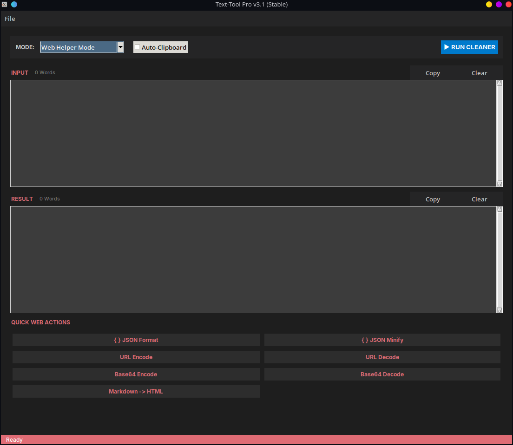
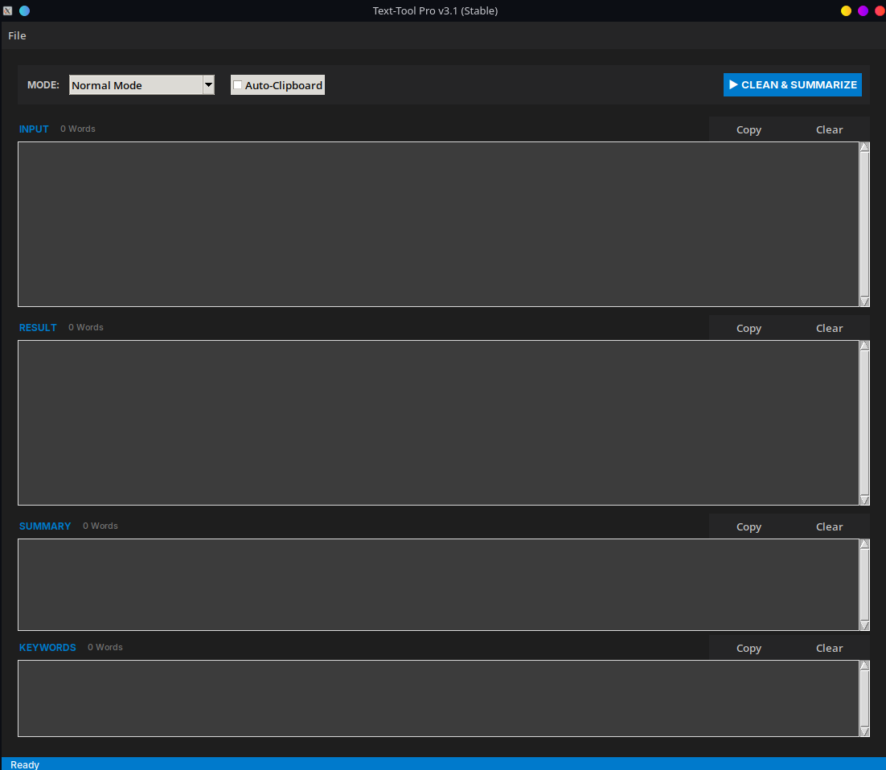

# Text Tool Pro 🚀

A powerful, dark-mode desktop utility for developers and writers on Linux. Built with Python and CustomTkinter, it streamlines text processing and web development tasks.

## ✨ Features

### 💻 Web Developer Mode
All your essential web utilities in one place. Format JSON, encode URLs, and generate boilerplate code instantly.



* **JSON Tools:** Validate, prettify, and minify ugly JSON strings.
* **Encoders/Decoders:** Base64 and URL encoding at the click of a button.
* **Web Boilerplate:** One-click generation of HTML5 templates and CSS Resets.

---

### 📝 Normal Mode (Text & NLP)
Powerful text manipulation and Natural Language Processing features for writers and editors.



* **Smart Cleaner:** Removes extra whitespace, fixes indentation, and normalizes text.
* **AI Summarizer:** Uses NLTK to compress long articles into 3 key sentences.
* **Keyword Extraction:** Automatically identifies the most important topics in a text.

---

### 🐧 Native Linux Integration
Text Tool Pro installs directly into your application menu and stays out of your way until you need it.


* **Clipboard Sync:** Input and Output automatically sync with your system clipboard (`xclip`).
* **Desktop Shortcut:** Launches like any other pro application, without a terminal window.

## 📦 Installation

### Option A: Binary Download (Recommended)
No Python installation required. Just download and run.
1. Go to the [Releases Page](https://github.com/wo0z1e/Text-tool/releases).
2. Download the latest `TextToolPro` executable.
3. Mark it as executable and run:
   ```bash
   chmod +x TextToolPro
   ./TextToolPro
